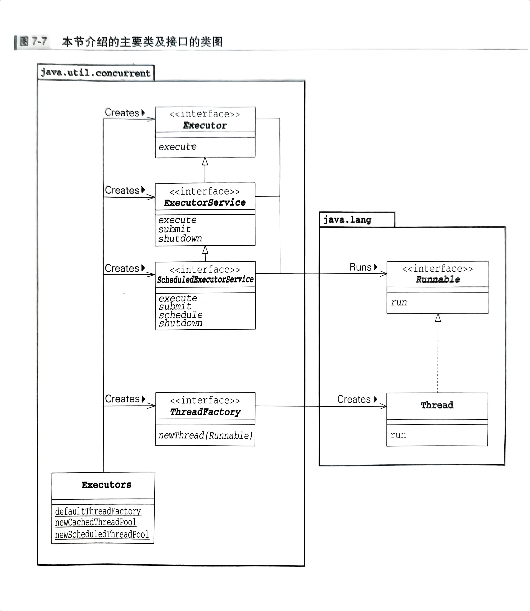
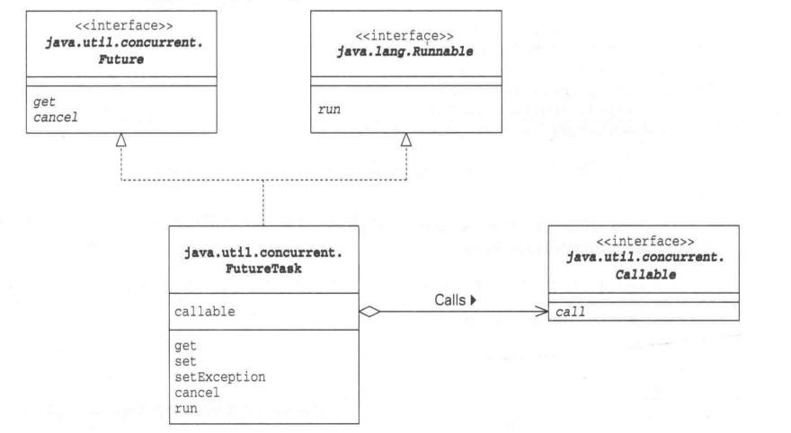

## Java多线程设计模式

### 多线程评价标准

- **安全性**——不损坏对象	==【必须】==
- **生存性/活性**——必要的处理能够被执行	==【必须】==
- **可复用性**——类可重复利用，e.g. JUC

- **性能**——能快速、大批量处理：吞吐量、响应性、容量

<br/>

### I.Single Threaded Execution模式

该模式会将修改或引用实例状态的地方设置为**临界区**，用于实现对临界资源的保护，即确保同一时间内只有一个线程执行处理。使用时应确定**保护对象**、**以什么单位保护**、**使用哪个锁保护**

> synchronized

 `char` `int` 等基本类型，以及对象等引用类型的**读写操作**是原子的，而`long` `double`在32位JVM上的读写不是原子的, 而在64位JVM上是原子的

> JUC-Semaphore

当我们想要确保某个区域“最多只能由N个线程”执行，就需要用**计数信号量**来控制

<br/>

**课后习题**

1. 在**Single Threaded Execution** 模式中，满足下述条件时，死锁便会发生：
   - 存在多个`SharedResource`角色
   - 请求和保持、不可剥夺
   - 获取`SharedResouce`角色的锁的顺序不固定（循环等待）
   
   那么我们破坏任一条件便可防止死锁发生，考虑**哲学家进餐问题**，我们可以有如下的解决思路：
   - 将筷子**打包**，以包作为竞争单位。
   - 每个人都按照 筷1 -> 筷2 ... 的顺序竞争。
   
   循环等待的前提便是有多个资源，即条件三的前提是条件一

<br/>

### II.Immutable

该模式旨在使用**确保实例状态不会发生改变的类**，这样在访问这些实例变量时无须执行互斥处理，故而可以提高性能

> 何时使用Immutable

- 实例创建后，状态不再发生改变
- 实例是共享的，且被频繁访问

> 考虑成对的mutable和immutable

为提高性能，将类分为`immutable`和`mutable`两种实现；e.g. `String`和`StringBuffer`

<br/>

### III.Guarded Suspension

该模式类似于“附加**条件**的`synchronized`”模式，相当于在`Single Threaded Execution`模式的基础上引入了**同步机制**：即消费者应该在队列不为空是才能取，生产者在队列不满时才能放

```java
//伪代码实现
class GuardObject{
    syn guardedMethod(){
      while(守护条件) wait();
      目标处理
    }
    
    syn stateChangedMethod(){
      目标处理
      notifyAll();
    }
}
```

<br/>

**课后习题**

1. `wait()` 和 `notifyAll()` 操作的都是`this`的等待队列，和你`GuardObject`中的自定义字段（e.g. queue）毫无关系
2. 在实现**同步机制**时，具有对称性的代码很有可能导致死锁，这个时候我们不妨加入一个**种子**，从而保证代码正常运行/正常结束

<br/>

### IV.Balking

该模式与`Guarded Suspension`模式类似，也存在守护条件。但该模式下守护条件不成立时，则**立刻中断返回**

> 使用时机

- 并不需要执行，因为之前已经执行过了
- 若守护条件不成立，想立即返回并进入下一步
- 守护条件仅在第一次成立时

```java
//伪代码
//initialized字段状态仅变化一次，称之为【闭锁】
class GuardObject{
    private boolean initialized = false;
    syn init(){
      if(initialized) return;   //balking
      具体处理
      initialized = true;
    }
}
```

> 超时 guarded timed

介于`Balking`和`Guarded Suspension`，我们选择在守护条件成立之前等待一段时间，如果到时条件还未成立，则直接`balk`

```java
//伪代码
class GuardObject{
    private boolean ready = false;
    private final long timeout;
    
    syn execute(){
      long start = System.currentTimeMillis();  //开始时间
      while(!ready){
        long now = System.currentTimeMillis();  //当前时间
        long rest = timeout-(now-start);        //剩余时间
        if(rest <= 0){
          throw new TimeoutException("...");
        }
        wait(rest);
      }
      具体处理
    }
    
    syn setExecutable(boolean on){
      ready = on;
      notifyAll();
    }
}
```

<br/>

### V.Producer-Consumer

生产者-消费者模式，当两者只有一个时，称之为`pipe`模式。该模式的目的是让**生产者可以安全地将数据交给消费者**，故而引入一个“中间角色“，负责线程协调运行

**重要启示：线程协调运行需要考虑”放在中间的东西“；线程互斥处理需要考虑”应该保护的东西“**

> InterruptedException

- `sleep`、`join`的线程被中断，立马在该线程中抛出异常
- `wait`的线程被中断，需要在该线程重新获取锁之后才会抛出异常（即在**入口队列**中的线程不会被中断）
- **`interrupt`不需要获取线程的锁；`notify/notifyAll`需要获取线程的锁**

> JUC-BolckingQueue

- `ArrayBlockingQueue` `LinkedBlockingQueue`
- `PriorityBlockingQueue`
- `DelayQueue`：在元素指定时间到期后才可以`take`，到期时间最长的元素先被`take`
- `SynchronousQueue`：用于执行`Producer`角色到`Consumer`角色的**直接传递**，即有一方没准备好时，另一方调用接口会被阻塞

> JUC-Exchanger

用于让两个线程安全地交换对象

<br/>

**课后习题：**

1. 如何实现 清除“中间角色”的所维护的数据
   ```java
   syn void clear(){
       清除操作...
       notifyAll();    //清除完要通知所有等待队列上的线程
   }
   ```

<br/>

### VI.Read-Write Lock

读者写者模式，**对不同种类线程的互斥处理分开考虑**：多个线程可以同时读取，读取时不能写入；一个线程写入时，其他线程不能读取或写入

该模式适用于**读取操作繁重**、**读取频率比写入频率高**时的情况

```java
public final class ReadWriteLock{
  private int readingReaders = 0;
  private int waitingWriters = 0;
  private int writingWriters = 0;
  private boolean preferWriter = true;    //防止写线程“饿死”
  
  public synchronized void readLock() throws InterruptedException{
    while(writingWriters > 0 || (preferWriter && waitingWriters > 0)){
      wait();
    }
    readingReaders++;
  }
  
  public synchronized void readUnLock() throws InterruptedException{
    readingReaders--;
    preferWriter = true;
    notifyAll();
  }
  
  public synchronized void writeLock() throws InterruptedException{
    waitingWriters++;   //用于配合preferWriter
    try{
      while(readingReaders > 0 || writingWriters > 0){
        wait();
      }
    } finally{
      waitingWriters--;
    }
    writingWriters++;
  }
  
  public synchronized void writeUnLock() throws InterruptedException{
    writingWriters--;
    preferWriter = false;
    notifyAll();
  }
}
```

> JUC-ReadWriteLock

```java
private final ReadWriteLock lock = new ReentrantReadWriteLock(true);
private final Lock readLock = lock.readLock();
private final Lock writeLock = lock.writeLock();
```

`ReentrantReadWriteLock`主要特征：

- **公平性**	
  
  让等待时间久的线程优先获得锁
- **可重入性**	
  
  `Reader`角色的线程可以获得“用于写入的锁”，`Writer`可获得“用于读取的锁”
- **锁降级**

<br/>

**课后习题：**

1. `waitingWriters`和`preferWriters`字段的含义：
   
   防止`ReaderThread`或者`WriterThread`不会**“饿死”**：`waitingWriters > 0`可以让`ReaderThread`线程等待，防止`WriterThread`饿死；再加上`preferWriters`控制两类进程哪一类更优先，防止`ReaderThread`饿死

<br/>

### VII.Thread-Per-Message

该模式是为每个命令或请求**新分配一个线程**，由这个线程来执行具体处理，实现**调用与执行相分离**。

目的在于提高程序响应性，是否选用取决于**线程启动耗时**与**具体操作耗时**间的均衡

> JUC-Executor



- `ThreadFactory` 将线程创建抽象化，`Executor` 将线程执行抽象化
- `ExecutorService` 将**被复用**的线程抽象化（所谓抽象化，就是对外隐藏了实现细节）
- `cheduleExecutorService` 将被调度的线程的执行抽象化

**！课后习题 7-5、7-7**

<br/>

### VIII.Worker Thread/Thread Pool

该模式类似于`Thread-Per-Message`和`Produce-Consumer`模式的结合。对于前者，优势在于新线程是事先启动的(存在于**线程池**中)，故而可以**节省线程启动时间**；对于后者，引入的线程池就相当于`Consumer`角色工作的环境，里面有`Channel`角色和`Consumer`角色

> Runnable的意义

Runnable对象可以作为方法参数传递，可以放入队列，可以跨越网络传递，也可以被保存至文件中。故而我们可以将其看作`Command`模式下的`Command`角色

**!课后习题8-5、8-6**

<br/>

### IX.Future

`Thread-Per-Message`将耗费时间的处理交给其他线程，可提高响应性。但是在将处理转交出去的时候，处理结果仍然未知，而等待处理结果的话程序响应性会降低

`Future`意义便在于，可以**在不用降低响应性的前提下获取结果，**做到“准备返回值”和“使用返回值”相分离

> Future角色的变种

- **不让主线程久等**。若`RealData`的实例还未准备好，主线程调用`getContent`方法时会进行等待(`Guarded Suspension`)，我们可以使用`Balking`，然后稍微执行些其他操作再去调用`getContent`
- **会发生变化。**通常情况下，“返回值”仅会被设置到Future角色中一次，即Future角色的状态只会改变一次。但有时也会有给Future角色设置“当前返回值”的需求，这是我们可以考虑反复设置“返回值”。

> JUC-Future（代码见VScode）



<br/>

### X.Two-Phase Termination

该模式可以做到"优雅地结束线程"，其要点在于：安全地终止线程**（安全性）**、必定进行终止处理**（生存性）**、发出终止请求后尽快执行终止处理**（响应性）**

> 终止处理

- 未捕获的异常处理器
  ```java
  Thread.setDefaultUncaughtExceptionHandler(
    new Thread.UncaughtExceptionHandler(){
      public void uncaughtException(Thread thread, Throwable e){
        //执行未捕获异常的处理
      }
    });
  ```

- 退出钩子
  
  **指java虚拟机退出时启动的线程，使用其来编写程序完全终止时的终止处理**
  ```java
  Runtime.getRuntime().addShutdownHook(
    new Thread(){
      public void run(){
        //终止处理
      }
    });
  ```

> JUC-CountDownLatch

实现"等待**指定次数**的`CountDown`方法被调用"这一功能

> JUC-CyclicBarrier

`CountDownLatch`只能进行倒数计数，而`CyclicBarrier`可以**周期性**的创建屏障，碰到屏障的线程是无法继续前进的。屏障的解除条件是**到达屏障处的线程个数达到了指定个数，**这样屏障解除，这簇线程便会一起“冲出去”

<br/>

### XI.Thread-Specific Storage

该模式利用了`ThreadLocal`**将线程特有信息存储在“线程之外”，**因此不同线程通过`ThreadLoacl`只能访问它特有的对象，无需显示地进行互斥处理。`ThreadLoacl`会利用**上下文信息**自动判断当前线程，可能会导致开发人员难以清楚地掌握处理中使用了哪些信息

<br/>

### XII.Active Object

该模式综合了`Producer-Consumer`、`Thread-Per Message`、`Future`等各模式

假设现在有委托处理方（`Client`角色）和执行处理方（`Servant`角色)。我们不希望当`Servant`角色的处理时间很长或是处理被推迟时，`Client`角色受到影响；另外，除了`Client`角色单向调用`Servant`角色，我们还希望实现**双向调用**（将执行结果从`Servant`角色返回给`Client`角色)。

使用`Active Object`模式，将`Client`的调用转变为`Task`存入**任务队列**中，使用**另一个线程**（`Scheduler`角色）从队列中取出要执行的`Task`，然后将处理委托给**真正执行的类**（`Servant`角色），此为实现了**调用与执行相分离**；在`Client`调用后立马返回`FutureResult`，`Client`在合适的时机从`FutureResult`中获取结果，此为实现了**双向调用**
